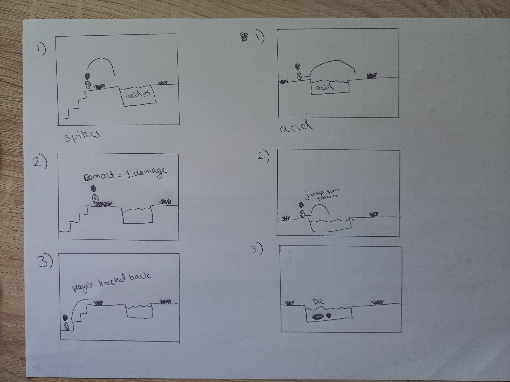

# COMP2150  - Level Design Document
### Name: Kunal Patel
### Student number: 47882972 

## 1. Player Experience (~700 words)
Outline and justify how your level design facilitates the core player experience goals outlined in the assignment spec. Each section should be supported by specific examples and screenshots of your game encounters that highlight design choices made to facilitate that particular experience.

### 1.1. Discovery
Movement basics: 
- Players are introduced to critical movement mechanics, including basic jumps, passthrough platforms, moving platforms and platform traversal. 
- The section layouts begin with simple, non-complex, spacious environments and platforms. When the player first encounters a moving platform they must learn to time their jumps. 
- The presence of spikes and acid provides a non-threatening consequence of failure as players lose one heart of health and can simply try again, encouraging experimentation.
        

Combat Mechanics:
- Players familiarise themselves with combat mechanics by engaging with two enemies both when they encounter the gun and the staff. 
- When the player acquires the gun they can either skip the enemies by utilising the moving platform or jump into the pit to face the enemies head on. Moving on, a staff can be acquired which presents melee capabilities. 
- The player will learn that destructible walls placed around the sections can be destroyed using melee. Health pickups are placed strategically in the environment to encourage the player to take risks and experiment with skills without fearing failure. 

- Player will learn the importance of keys for progression
- Placing keys in the presence of enemies and requiring utilisation of basic mechanics in difficult/risky situations incentives the player to engage in these situations. 
- All keys must be collected to finish the level. 
- There is a key UI available in the player’s HUD to see the progress of their key progression

### 1.2. Drama
The incorporation of challenging obstacles, intense combat scenarios throughout the sections creates an immersive and dynamic experience that evokes several emotions from players. Similarly, the strategic placement of these obstacles and pacing of encounters contributes to the overall dramatic arc of the sections, establishing a sense of satisfaction and accomplishment as they overcome these challenges. 

Heightened tension when facing hazardous terrain, jumping and movement precision needed when facing spikes and acid as well as several enemies in claustrophobic environments. Each encounter is designed to progressively increase the level of drama, keeping players engaged and invested in their progress.

The use of moving platforms increases the unpredictability to player movements, requiring careful decision making, spatial awareness and timing as not only can there be acid and spikes but also several enemies. Further increasing the stakes as multitasking is required by the player. As the player moves through the sections, intensity ramps up with different encounters everytime.

### 1.3. Challenge
Gradual introduction of challenges, starting with simple combat situations and platforming in the tutorial section, where gradually there is an increase in complexity in subsequent actions. Allowing players to build confidence and skills progressively. 

The difficulty of the situations and encounters within the sections scales appropriately with the player’s progression. An example of this is, increasing number of enemies, spikes, acid and platforming difficulty. Where the final section involves several moving and static platforms where failure may lead to certain death. 

The game includes several checkpoints strategically placed throughout the level to allow players to respawn before key points upon failure rather than starting from the start resulting in mush less player frustrations and a stable maintenance of momentum. 

The presence of flow within the game represents the optimal balance between skill level and challenges to cater to players that are fully immersed in the gameplay experience. Challenges throughout the level are designed to be difficult yet also achievable, providing a sense of accomplishment upon section completions without overwhelming the player. 

### 1.4. Exploration
Hidden Secrets: Throughout the level, there are hidden or hard to get areas where players can find health pick-ups or checkpoints that reward players for exploration. These secrets are often tucked away in corners or behind obstacles, enticing players to venture off the beaten path and discover new surprises.

Interactive Elements: Interactive elements like movable platforms, destructible objects and pushable boxes are scattered throughout the level, inviting players to interact with their surroundings and uncover hidden pathways or rewards.
Backtracking: Certain sections of the level may require players to backtrack or revisit previously explored areas to ensure all keys have been found. This encourages thorough exploration and rewards players for paying attention to their surroundings.

## 2. Core Gameplay (~400 words)
A section on Core Gameplay, where storyboards are used to outline how you introduce the player to each of the required gameplay elements in the first section of the game. Storyboards should follow the format provided in lectures.

Storyboards can be combined when multiple mechanics are introduced within a single encounter. Each section should include a sentence or two to briefly justify why you chose to introduce the mechanic/s to the player in that sequence.

You should restructure the headings below to match the order they appear in your level.

### 2.1. Keys

### 2.2. Passthrough Platforms

### 2.3. Checkpoints

### 2.4. Spikes

### 2.5. Acid

### 2.6. Health Pickups

### 2.7. Chompers

### 2.8. Spitters

### 2.9. Moving Platforms

### 2.10. Weapon Pickup (Gun)

### 2.11. Weapon Pickup (Staff)

## 3. Spatiotemporal Design
A section on Spatiotemporal Design, which includes your molecule diagram and annotated level maps (one for each main section of your level). These diagrams may be made digitally or by hand, but must not be created from screenshots of your game. The annotated level maps should show the structure you intend to build, included game elements, and the path the player is expected to take through the level. Examples of these diagrams are included in the level design lectures.

No additional words are necessary for this section (any words should only be within your images/diagrams).
 
### 3.1. Molecule Diagram

### 3.2. Level Map – Section 1

### 3.3.	Level Map – Section 2

### 3.4.	Level Map – Section 3

## 4. Iterative Design (~400 words)
Reflect on how iterative design helped to improve your level. Additional prototypes and design artefacts should be included to demonstrate that you followed an iterative design process (e.g. pictures of paper prototypes, early grey-boxed maps, additional storyboards of later gameplay sequences, etc.). You can also use this section to justify design changes made in Unity after you drew your level design maps shown in section 3. 

You should conclude by highlighting a specific example of an encounter, or another aspect of your level design, that could be improved through further iterative design.

An iterative design process was followed in order to refine and improve the player’s experience. Gathering feedback, making iterative changes based on playtesting prototypes and the use of paper prototypes are the processes involved with this process. 

We began by creating simple level sections by using only the background tile maps in unity to prototype the layout and flow of the sections. These earlier prototypes and level designs helped in the experimentation with the various level designs as well as identifying possible issues with pacing, progression and difficulty. Requirements were also needed to be met.  We created some paper prototypes, mainly drawings, to assist in visualising specific gameplay mechanics and encounters. These prototypes allowed for quick test ideas and making adjustments before implementing them into the level design. 

Storyboarding was used to visualise and plan key gameplay sequences, this includes, checkpoint, enemy, health pickup, key and obstacle placements. With the use of storyboarding these sequences we were able to ensure appropriate placements to ensure proper pacing and to iterate the design so that the player was provided a satisfying and engaging experience. Numerous playtesting sessions with several groups of players were held in order to gather feedback on the section designs. What needed improvements, what was done correctly, etc. was the feedback from these playtesters which helped identify areas for improvement in order to enhance overall gameplay experience. 

Design Changes within Unity:

After drawing level design maps for each section, we implemented the designs into Unity where we made numerous design changes depending on playtesting feedback and our own observations: 

Adjusting of enemy placements: reposition of enemies and obstacles were required to create a more balanced and engaging encounters throughout the sections. Tweaking of enemy spawn points meant some needed to be removed or repositioned which was also the case for other interactable elements such as acid, health pickups, etc. This was done in the intention to ensure encounters feel challenging yet fair. Refining of platforming challenges: we refined several platforming sections by altering the placement of the platforms, including timing and spacing to improve both the pace and flow of the gameplay. This involved iterating on jump timing, jump distances, environmental hazards, platform speeds in order to create a more satisfying and intuitive platforming challenge and experience. 

Early Design Sketches:

### Tool Used: Figma
**Nature of Use** Creation of Molecule Diagram

**Evidence Attached?** 

**Additional Notes:** I used this tool to assist me in creating my by molecule diagram. 

